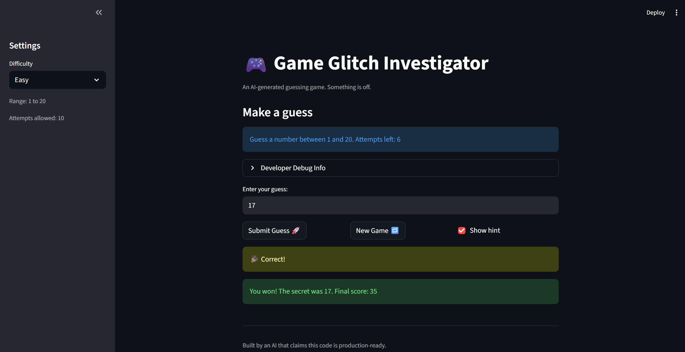

# 🎮 Game Glitch Investigator: The Impossible Guesser

## 🚨 The Situation

You asked an AI to build a simple "Number Guessing Game" using Streamlit.
It wrote the code, ran away, and now the game is unplayable. 

- You can't win.
- The hints lie to you.
- The secret number seems to have commitment issues.

## 🛠️ Setup

1. Install dependencies: `pip install -r requirements.txt`
2. Run the broken app: `python -m streamlit run app.py`

## 🕵️‍♂️ Your Mission

1. **Play the game.** Open the "Developer Debug Info" tab in the app to see the secret number. Try to win.
2. **Find the State Bug.** Why does the secret number change every time you click "Submit"? Ask ChatGPT: *"How do I keep a variable from resetting in Streamlit when I click a button?"*
3. **Fix the Logic.** The hints ("Higher/Lower") are wrong. Fix them.
4. **Refactor & Test.** - Move the logic into `logic_utils.py`.
   - Run `pytest` in your terminal.
   - Keep fixing until all tests pass!

## 📝 Document Your Experience

- [ ] Describe the game's purpose.
      is a number-guessing game built with Streamlit. The player selects a difficulty level (Easy, Normal, or Hard), each with a different number range and attempt limit. The game generates a secret number and the player tries to guess it within the allowed attempts.
- [ ] Detail which bugs you found.
      ## Bug List and Issues Identified

| # | Issue Description | Location |
|---|---|---|
| 1 | Hard range was **1–50**, easier than Normal's **1–100** | `get_range_for_difficulty` |
| 2 | Hint messages were reversed — **too high → "Go HIGHER"**, **too low → "Go LOWER"** | `check_guess` |
| 3 | On every even attempt, `secret` was cast to **string**, breaking integer comparison and making correct guesses impossible | submit block |
| 4 | No **range validation** — guesses outside difficulty range were accepted | `parse_guess` |
| 5 | **Easy mode had fewer attempts (6)** than Normal (8), making Easy harder | `attempt_limit_map` |
| 6 | **Hard mode only had 5 attempts** for a **1–1000 range** | `attempt_limit_map` |
| 7 | Attempts initialized to **1 instead of 0**, skipping the first count | session state init |
| 8 | Attempt counter increased even for **invalid guesses**, wasting turns | submit block |
| 9 | `update_score` used **attempt_number + 1**, making first-attempt score **80 instead of 90** | `update_score` |
|10 | **New Game** reset attempts and secret only — **score, status, history remained** | new_game block |
|11 | **New Game secret hardcoded** to `randint(1,100)` regardless of difficulty | new_game block |
|12 | No **Reset button** on the game over / win screen | UI |
|13 | `st.info` rendered **before submit executed**, so attempt count never reflected the current guess | `st.info` display |
|14 | Changing **difficulty didn’t regenerate secret**, so Easy could still use secret up to 1000 | session state init |
|15 | All functions in `logic_utils.py` were **stubs (NotImplementedError)** | `logic_utils.py` |
|16 | `get_range_for_difficulty` missing fallback `return (1, 100)` | `logic_utils.py` |
- [ ] Explain what fixes you applied.
      ## Fixes Implemented

| # | Fix | Description |
|---|---|---|
| 1 | Hard Range | Changed range to **1–1000** so difficulty scales properly: Easy → Normal → Hard |
| 2 | Hint Messages | Corrected hints so **too high → "Go LOWER"** and **too low → "Go HIGHER"** |
| 3 | Type Flip Bug | Removed `str()` conversion so `secret` remains an **integer** throughout the game |
| 4 | Range Validation | Added `low` and `high` parameters to `parse_guess`; out-of-range guesses return an error |
| 5 | Easy Attempts | Increased attempts to **10** so Easy > Normal (8) > Hard (6) |
| 6 | Hard Attempts | Set Hard difficulty attempts to **6** |
| 7 | Attempts Initialization | Fixed attempt counter to start at **0 instead of 1** |
| 8 | Attempt Counting | Moved attempt increment inside the **valid guess block** so invalid guesses don’t waste turns |
| 9 | Score Calculation | Removed `+1` offset from `attempt_number + 1` in `update_score` |
|10 | New Game Reset | New game now resets **score, status, and history** along with attempts and secret |
|11 | New Game Range | Replaced hardcoded `randint(1,100)` with `randint(low, high)` |
|12 | Reset Button | Added **"Reset Game"** button on the game-over and win screens |
|13 | Attempt Display | Replaced `st.info` with an **`st.empty()` placeholder** updated after submission |
|14 | Difficulty Switching | Changing difficulty now **regenerates secret and resets game state** |
|15 | logic_utils Implementation | Implemented all four functions in `logic_utils.py` (removed `NotImplementedError`) |
|16 | Fallback Return | Added fallback `return (1, 100)` to `get_range_for_difficulty` |

## 📸 Demo

- [ ] 

## 🚀 Stretch Features

- [ ] [If you choose to complete Challenge 4, insert a screenshot of your Enhanced Game UI here]
